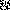

# day 20

## transformations

I didn't want to calculate the image transformations myself, so I used java's `java.awt.geom.AffineTransform`.
I created a 4x4 testimage with 16 different shades of red to calculate a hash of the overall image to check, which transformation yield the same result.

all 18 possible transformations

- Clockwise180
- Clockwise180,FlipHorizontal
- Clockwise180,FlipVertical
- Clockwise270
- Clockwise270,FlipHorizontal
- Clockwise270,FlipVertical
- Clockwise90
- Clockwise90,FlipHorizontal
- Clockwise90,FlipVertical
- FlipHorizontal
- FlipHorizontal,Clockwise180
- FlipHorizontal,Clockwise270
- FlipHorizontal,Clockwise90
- FlipVertical
- FlipVertical,Clockwise180
- FlipVertical,Clockwise270
- FlipVertical,Clockwise90
- NoOp

### examples of different transformations yielding the same image

| image                                                                                                                                                                | transformations            | hash                                     |
| -------------------------------------------------------------------------------------------------------------------------------------------------------------------- | -------------------------- | ---------------------------------------- |
|                      | NoOp                       | 0153045607590105120135150165180195210225 |
|  | Clockwise270, FlipVertical | 0601201801575135195309015021045105165225 |
|   | FlipVertical, Clockwise90  | 0601201801575135195309015021045105165225 |
|  | Clockwise180, FlipVertical | 1801952102251201351501656075901050153045 |
|            | FlipHorizontal             | 1801952102251201351501656075901050153045 |

### There are only 8 distinct transformations

| image                                                                                                                                                               | transformations           | hash                                     |
| ------------------------------------------------------------------------------------------------------------------------------------------------------------------- | ------------------------- | ---------------------------------------- |
|                     | NoOp                      | 0153045607590105120135150165180195210225 |
|              | Clockwise90               | 4510516522530901502101575135195060120180 |
|             | Clockwise180              | 2252101951801651501351201059075604530150 |
|             | Clockwise270              | 1801206001951357515210150903022516510545 |
|  | Clockwise90, FlipVertical | 2251651054521015090301951357515180120600 |
|           | FlipHorizontal            | 1801952102251201351501656075901050153045 |
|             | FlipVertical              | 4530150105907560165150135120225210195180 |
|  | FlipVertical, Clockwise90 | 0601201801575135195309015021045105165225 |

## image transformations

take this tile from the example input

```text
Tile 1951:
#.##...##.
#.####...#
.....#..##
#...######
.##.#....#
.###.#####
###.##.##.
.###....#.
..#.#..#.#
#...##.#..
```

### tiles as images

| image                                                                                                               | transformations           |
| ------------------------------------------------------------------------------------------------------------------- | ------------------------- |
|                     | NoOp                      |
|             | Clockwise180              |
|             | Clockwise270              |
|              | Clockwise90               |
|  | Clockwise90, FlipVertical |
|           | FlipHorizontal            |
|             | FlipVertical              |
|  | FlipVertical, Clockwise90 |
